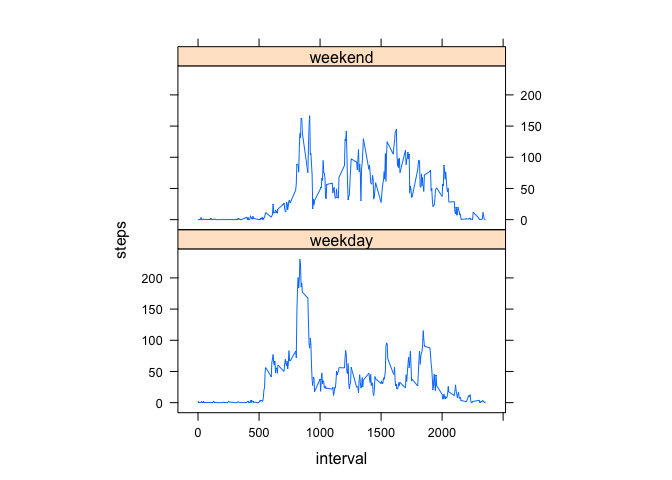

# Reproducible Research: Peer Assessment 1


## Loading and preprocessing the data
1. Load the data
    
    ```r
    unzip("activity.zip")
    origin_data <- read.csv("activity.csv")
    ```

2. Process/transform the data (if necessary) into a format suitable for your analysis
    
    ```r
    na_data <- subset(origin_data,is.na(origin_data$steps))
    not_na_data <- subset(origin_data,!is.na(origin_data$steps))
    ```

## What is mean total number of steps taken per day?
1. Make a histogram of the total number of steps taken each day
    
    ```r
    steps_per_day <- aggregate(steps ~ date, data = not_na_data, sum)
    hist(steps_per_day$steps)
    ```
    
     

2. Calculate and report the mean and median total number of steps taken per day
    * the mean total number of steps taken per day
        
        ```r
        mean(steps_per_day$steps)
        ```
        
        ```
        ## [1] 10766.19
        ```
        The mean is 1.0766189\times 10^{4}.
        
    * the median total number of steps taken per day
        
        ```r
        median(steps_per_day$steps)
        ```
        
        ```
        ## [1] 10765
        ```
        The median is 10765.
        
## What is the average daily activity pattern?
1. Make a time series plot (i.e. type = "l") of the 5-minute interval (x-axis) and the average number of steps taken, averaged across all days (y-axis)
    
    ```r
    avg_steps_per_interval <- aggregate(steps ~ interval, data = not_na_data, mean)
    plot(avg_steps_per_interval$interval,avg_steps_per_interval$steps,type = "l",xlab = "interval",ylab = "average steps of all days")
    ```
    
     

2. Which 5-minute interval, on average across all the days in the dataset, contains the maximum number of steps?
    
    ```r
    max_steps_index <- which.max(avg_steps_per_interval$steps)
    interval_contains_max <- avg_steps_per_interval$interval[max_steps_index[1]]
    interval_contains_max
    ```
    
    ```
    ## [1] 835
    ```
    The interval 835 contains the maximum number of steps.
    
## Imputing missing values
1. Calculate and report the total number of missing values in the dataset (i.e. the total number of rows with NAs)
    
    ```r
    length(na_data$steps)
    ```
    
    ```
    ## [1] 2304
    ```
    The total number of missing values is 2304 rows.
    
2. Devise a strategy for filling in all of the missing values in the dataset. The strategy does not need to be sophisticated. For example, you could use the mean/median for that day, or the mean for that 5-minute interval, etc.
    1. Split the dataset to tow subset with "NA" and without "NA" respectively and call them "na_data" and "not_na_data".
        
        ```r
        na_data <- subset(origin_data,is.na(origin_data$steps))
        not_na_data <- subset(origin_data,!is.na(origin_data$steps))
        ```
    2. Select the columns "date" and "interval" from the "na_data" to form a new data frame.
        
        ```r
        date_interval <- subset(na_data, select = c(date, interval))
        ```
    3. Calculate the mean across all days for 5-minute interval from "not_na_data" and call it "avg_steps_per_interval".
        
        ```r
        avg_steps_per_interval <- aggregate(steps ~ interval, data = not_na_data, mean)
        ```
    4. Select the columns "steps" and "interval" from the "avg_steps_per_interval" to form a new data frame.
        
        ```r
        steps_interval <- subset(avg_steps_per_interval, select = c(steps, interval))
        ```
    5. Merge these two new data frame.
        
        ```r
        filled_data <- merge(steps_interval,date_interval)
        ```
    6. Combine the new mergeed data frame and "not_na_data" .The result data frame is dataset filled missing values.
        
        ```r
        all_filled_data <- rbind(not_na_data,filled_data)
        ```

3. Create a new dataset that is equal to the original dataset but with the missing data filled in.
    * The data frame "all_filled_data" in previous step is the new dataset that is equal to the original dataset but with the missing data filled in.

4. Make a histogram of the total number of steps taken each day and Calculate and report the mean and median total number of steps taken per day. Do these values differ from the estimates from the first part of the assignment? What is the impact of imputing missing data on the estimates of the total daily number of steps?
    * Make a histogram of the total number of steps taken each day
        
        ```r
        all_steps_per_day <- aggregate(steps ~ date, data = all_filled_data, sum)
        hist(all_steps_per_day$steps)
        ```
        
         
    * Calculate and report the mean and median total number of steps taken per day
        * the mean total number of steps taken per day
            
            ```r
            mean(all_steps_per_day$steps)
            ```
            
            ```
            ## [1] 10766.19
            ```
            The mean is 1.0766189\times 10^{4}.
        * the median total number of steps taken per day
            
            ```r
            median(all_steps_per_day$steps)
            ```
            
            ```
            ## [1] 10766.19
            ```
            The median is 1.0766189\times 10^{4}.
    * Do these values differ from the estimates from the first part of the assignment?  
        * The mean is the same but the median difference.
    * What is the impact of imputing missing data on the estimates of the total daily number of steps?  
        * I just fill mean data to missing data, so the mean data of filled data is same. And median is independent of mean.

## Are there differences in activity patterns between weekdays and weekends?
1. Create a new factor variable in the dataset with two levels -- "weekday" and "weekend" indicating whether a given date is a weekday or weekend day.
    1. Conver date to weekdays.
        
        ```r
        day_type <- weekdays(as.Date(all_filled_data$date))
        ```
    2. Conver weekdays to "weekday" and "weekend". Sunday and Saturday are "weekend", others are "weekday". But my computer's operating system is not English language, "Sunday" named "星期日" and "Saturday" named "星期六" in my computer. **When you reproduct this script you need to replace "星期日" to "Sunday" and "星期六" to "Saturday".**
        
        ```r
        weekend_logic <- day_type == "星期日" | day_type == "星期六"
        all_filled_data$day_type <- ifelse(weekend_logic,"weekend", "weekday")
        ```
        
    The data frame "all_filled_data" now contain a coloumn named "day_type" indicating whether that day is a weekday or weekend day.

2. Make a panel plot containing a time series plot (i.e. type = "l") of the 5-minute interval (x-axis) and the average number of steps taken, averaged across all weekday days or weekend days (y-axis). 
    
    ```r
    avg_steps_per_interval_by_day_type <- aggregate(steps ~ interval + day_type, data = all_filled_data, mean)
    library(lattice)
    xyplot(steps ~ interval | factor(day_type), data = avg_steps_per_interval_by_day_type, aspect = 1/2, type = "l")
    ```
    
     


